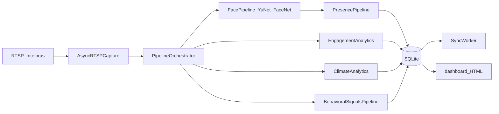

# Arquitetura atual — Dulino Edge Vision (baseline Fase 0)

## Visão geral

Sistema **edge local** (FastAPI + SQLite) para presença facial e sinais observáveis em sala de aula. Processamento 100% local; vídeo não é gravado continuamente (latest-frame). Sync opcional via fila `events` → ingest HTTP (Supabase).

## Componentes principais

| Área | Path | Notas |
|------|------|-------|
| API | `app/main.py` | Rotas flat; sem `/api/v1` ainda |
| Auth | `app/auth.py` | `API_AUTH_TOKEN` opcional |
| Config | `app/config.py` + `config.yaml` | Pydantic Settings + YAML |
| Captura | `app/rtsp/*` | Latest-frame; buffer size 1 |
| Orquestrador | `app/pipeline/orchestrator.py` | Timers 20/6/2/3 Hz |
| Presença | `app/pipeline/presence.py` | Dono exclusivo do check-in |
| Tracker facial | `app/vision/tracker.py` | `BboxTracker` IoU |
| Detector | `app/vision/detector.py` | YuNet |
| Embedder | `app/vision/embedder.py` | FaceNet 512-d |
| Sinais faciais | `app/vision/facial_signals.py` | MediaPipe Face Mesh |
| FER legado | `app/vision/emotion_engagement.py` | Mini-XCEPTION; off no clima |
| Phone YOLO | `app/vision/phone_yolo.py` | Desligado |
| Temporal | `app/pipeline/temporal_aggregator.py` | Durações mínimas |
| DB | `app/db/models.py`, `repo.py` | 9 tabelas |
| Dashboard | `app/static/dashboard.html` | Polling 12s |

## Regras invioláveis (produto)

1. `attendance_checkin` é independente da observação contínua.
2. Perda visual / oclusão **não** remove presença.
3. Módulos analíticos **não** alteram presença automaticamente.
4. Sem diagnóstico psicológico; nomenclatura ética (sinais aparentes).

## Lacunas vs roadmap (pós-baseline)

- Fase 0.5: spike real + escolha de provider (máx. `shadow`)
- PersonTrack / FaceTrack / IdentityBinding
- `/debug/vision` protegido
- Modos `disabled|debug|shadow|production`
- API v1 + WebSocket + dashboard React (após calibração)
- LXP: contrato/mock apenas até spec HTTP

## Documentos relacionados

- [baseline-metrics.md](baseline-metrics.md)
- [vision-pipeline.md](vision-pipeline.md)
- [gates.md](gates.md)
- [thresholds-frozen.md](thresholds-frozen.md)
