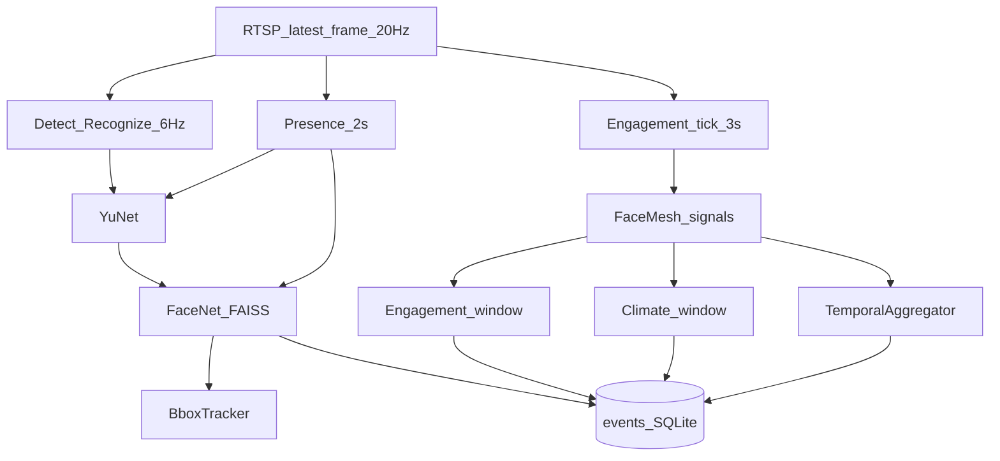

# Vision pipeline — baseline e evolução prevista

## Pipeline atual (Fase 0)

### Detalhes

| Etapa | Implementação | Intervalo |
|-------|---------------|-----------|
| Captura | `AsyncRTSPCapture` / webcam | ~20 Hz consume |
| Overlay | YuNet + embedding + match | ~6 Hz |
| Presença | `PresencePipeline` + dedup | 2 s |
| Engajamento | `EngagementAnalytics` + head pose | amostragem 3 s; janela 10 s |
| Clima | `ClimateAnalytics` (sem FER default) | flush 15 s |
| Behavioral | `BehavioralSignalsPipeline` | mesmo tick engajamento |
| Phone | `phone_yolo` | off |

### Tracking atual

- Apenas `BboxTracker` (IoU) na presença.
- Behavioral usa índices `t0, t1…` (instável).
- **Roadmap:** PersonTrack + FaceTrack + IdentityBinding (não só IoU).

## Pipeline alvo (pós fases autorizadas)

Ver plano: FrameScheduler → Person/Face detect → tracks → IdentityBinding → landmarks → expression (shadow) → phone → pose mínima → temporal → fusion → debug UI → (depois) SQLite tipado / React / LXP mock.

## Modos de módulo (Fase 1+)

`disabled | debug | shadow | production` — nunca promover provider direto a `production` após spike (máx. `shadow`).
